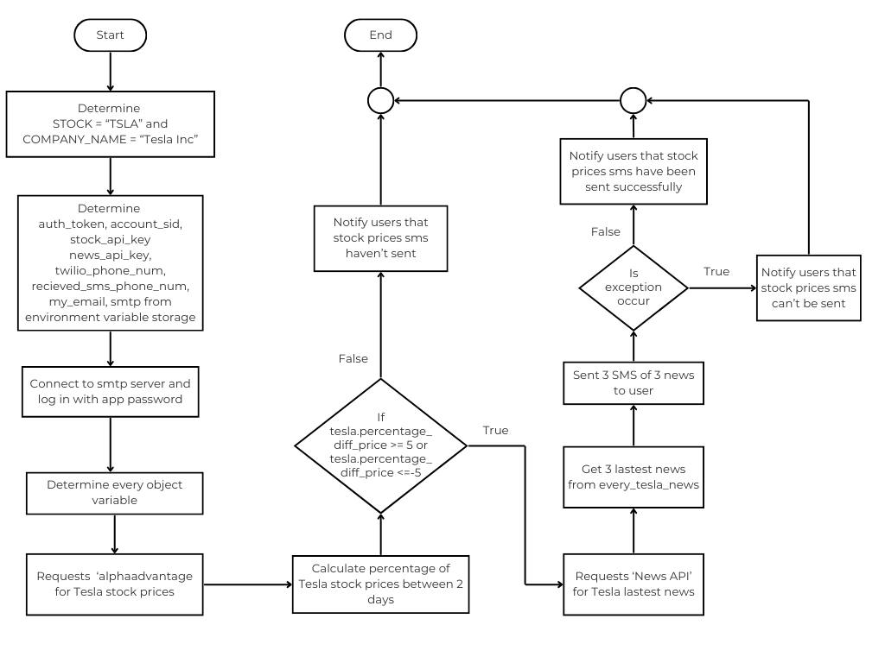

# Stock-Prices
**Stock-Prices** is a projects that developed by Python using REST API to fetch and evaluate the stock prices of a specific company between two days. The project notifies users via SMS and email with the percentage of stock prices change along with related news.

## Overview
The project utilize REST API to retrieve stock prices of specific company and calculate the percentage of stock prices changing between 2 days. 

The percentage is utilized as compared value. Additionally, the news and SMS is provided when the percentage is changed significantly more than 5% or less than -5%. Afterward, email and SMS will be used as notification tools to notify user.

## API 
The project integrate and utilize 2 REST API.

1. **Alphavantage** used for provides stock price data for specified company at defined specific interval. See more details here *[Alphavantage Website](https://www.alphavantage.co/)*

2. **News API** used for retrieve news topic and article data of specified company. See more details here *[News API](https://newsapi.org )*

## Diagram


## Usage 
Before executing the projects, please follow **Initial Setup** instruction.

### Initial Setup
1. Ensure your *Python Version* is updated to lastest version, recommanded version is higher than `3.10.0`
    ```Bash
    python --version
    ```

2. Install all necessary packages.
    ```
    pip install -r requirements.txt
    ```

3. Log in to `Twilio` account and get `auth_token` and `account_sid`, set them to `main.py` as environment variables.
    ```Python
    auth_token = os.environ.get("auth_token")
    account_sid = os.environ.get("account_sid")
    ```

    After `Twilio` account has been registered, user will recieve a **Twilio phone number**. Determine it and user phone number to `main.py` as environment variables.
    ```Python
    twilio_phone_num = os.environ.get("twilio_phone_number") 
    recieved_sms_phone_num = os.environ.get("my_phone_number")
    ```

4. Register to **Alphavantage** and **News API** account to obtain *API keys*. Determine them as environment variables in `main.py`.
    ```Python
    stock_api_key = os.environ.get("stock_api_key")
    news_api_key = os.environ.get("news_api_key")
    ```

5. Provide user *email* and *app password* to `main.py` as environment variables.
    ```Python
    my_email = os.environ.get("my_email")
    smtp_pass = os.environ.get("smtp_pass")
    ```

### Custom Setup 
1. `STOCK` and `COMPANY_NAME` values are flexible, which means users can change these to other companies, but `STOCK` and `COMPANY_NAME` must be the same company. If company has been changed, `tesla.py` modules name must be changed for example.

    In `main.py`
    ```Python
    STOCK = "NVDA"
    COMPANY_NAME = "NVIDIA Corp"
    ```

    In `tesla.py` is changed to `nvidia.py` and internal class must be changed.
    ```Python
    import requests

    class Nvidia():
        ...
    ```

2. Percent threshold to compared can be adjusted in `main.py` as example below.
    ```Python
    if tesla.percentage_diff_price >= 3 or tesla.percentage_diff_price <= -2:
        ...
    ```

3. The total news articles sent via emails can be adjusted by changing ` the_amount_of_news` parameter.
    ```Python
    tesla.getting_filtered_news_list(every_tesla_news = every_tesla_news, the_amount_of_news = 3)
    ```

4. In `main.py`, user can adjust `to_email` parameter from `email_sendor` object declaration as desired for define recieved email.
    ```Python
    email_sendor = EmailSendor(from_email = my_email, to_email = "User_phone_number")
    ```

5. In `recieved_sms_phone_num`, user can adjust `my_phone_number` in environment variables setting. please bear in mind, `my_phone_number` must be verified twilio number.
    ```Python
    recieved_sms_phone_num = os.environ.get("my_phone_number")
    ```
### Executing Project
Once all necessary setup have been provided, project can be executed by following command.
```
python main.py
```